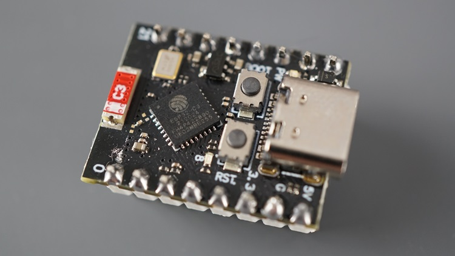
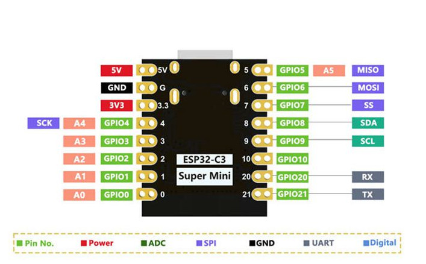
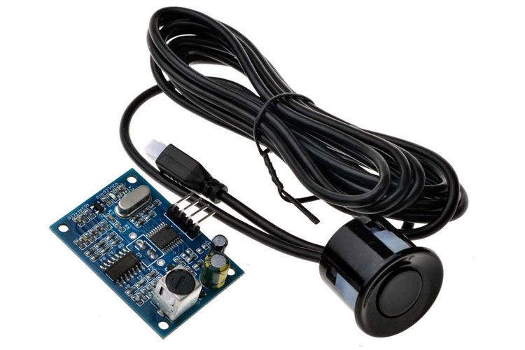

## Hardware

### Microcontroller

* **ESP32-C3 Super Mini** - Ultra-compact development board based on the Espressif ESP32-C3 RISC-V chip.
    * [Official Datasheet](https://documentation.espressif.com/esp32-c3_datasheet_en.html) - Core chip architecture and electrical characteristics.
    * [Specification for Development](https://docs.zephyrproject.org/latest/boards/others/esp32c3_supermini/doc/index.html) - Pinout details and board configuration references.

### Sensors & Peripherals

* **JSN-SR04T** — Waterproof ultrasonic distance measurement module, ideal for harsh and humid environments inside a brine tank.
    * [Datasheet & Application Guide](https://components101.com/sensors/jsnsr04t-waterproof-ultrasonic-sensor-pinout-datasheet-working-application-alternative) — Detailed working principle and timing diagrams.

## Technical Notes & Caveats

* **Power Supply:** The `JSN-SR04T` sensor requires a **5V** stable power supply to function correctly. Connect its `VCC` to the `5V` pin of the ESP32-C3 (fed via USB-C).
* **Logic Levels (Important):** The ESP32-C3 operates on **3.3V logic**. While the sensor's `TRIG` pin usually accepts 3.3V signals from the ESP32, the `ECHO` pin outputs a 5V signal. It is highly recommended to use a **voltage divider** (e.g., 1kΩ and 2kΩ resistors) or a logic level shifter on the `ECHO` line to protect the microcontroller's GPIO.
* **Blind Spot:** Keep in mind that the `JSN-SR04T` has a minimum blind distance of **20 cm**. The sensor probe must be mounted at least 25 cm above the maximum possible salt/water level.
